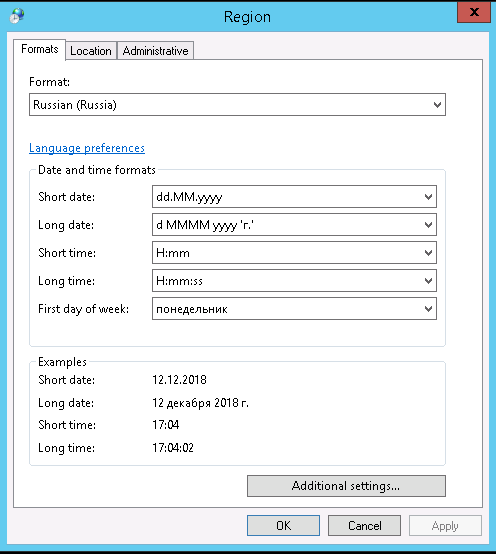

         

# Инструкция по установке клиентского обеспечения IntelliSpace Critical Care and Anesthesia (ICCA)

From Даза банных

[Jump to navigation](http://10.1.31.115:6969/mediawiki/index.php/%D0%98%D0%BD%D1%81%D1%82%D1%80%D1%83%D0%BA%D1%86%D0%B8%D1%8F_%D0%BF%D0%BE_%D1%83%D1%81%D1%82%D0%B0%D0%BD%D0%BE%D0%B2%D0%BA%D0%B5_%D0%BA%D0%BB%D0%B8%D0%B5%D0%BD%D1%82%D1%81%D0%BA%D0%BE%D0%B3%D0%BE_%D0%BE%D0%B1%D0%B5%D1%81%D0%BF%D0%B5%D1%87%D0%B5%D0%BD%D0%B8%D1%8F_IntelliSpace_Critical_Care_and_Anesthesia_\(ICCA\)#mw-head) [Jump to search](http://10.1.31.115:6969/mediawiki/index.php/%D0%98%D0%BD%D1%81%D1%82%D1%80%D1%83%D0%BA%D1%86%D0%B8%D1%8F_%D0%BF%D0%BE_%D1%83%D1%81%D1%82%D0%B0%D0%BD%D0%BE%D0%B2%D0%BA%D0%B5_%D0%BA%D0%BB%D0%B8%D0%B5%D0%BD%D1%82%D1%81%D0%BA%D0%BE%D0%B3%D0%BE_%D0%BE%D0%B1%D0%B5%D1%81%D0%BF%D0%B5%D1%87%D0%B5%D0%BD%D0%B8%D1%8F_IntelliSpace_Critical_Care_and_Anesthesia_\(ICCA\)#p-search)

Установку программного обеспечения необходимо делать, используя учетную запись с правами локального администратора Перед установкой клиентского программного обеспечения – необходимо убедиться, что установлена time zone: UTC +3:00 Москва, Санкт-Петербург и проверить формат региональных настроек

- Открыть сетевую папку **\\icca1\client.**
- Скопировать IntelliSpace Critical Care and Anesthesia.msi на рабочую станции
- Запустить IntelliSpace Critical Care and Anesthesia.msi от имени администратора
- Появится окно InstallShield Wizard, предлагающие установку дополнительных компонентов – нажать Install

[%20-%20Даза%20банных_files/ICCA2.png)](http://10.1.31.115:6969/mediawiki/index.php/File:ICCA2.png)

[%20-%20Даза%20банных_files/ICCA3.png)](http://10.1.31.115:6969/mediawiki/index.php/File:ICCA3.png)

[%20-%20Даза%20банных_files/ICCA4.png)](http://10.1.31.115:6969/mediawiki/index.php/File:ICCA4.png)

[%20-%20Даза%20банных_files/ICCA5.png)](http://10.1.31.115:6969/mediawiki/index.php/File:ICCA5.png)

- После установки запускается Machine Setup – в качестве сервера нужно указать ICCA

[%20-%20Даза%20банных_files/ICCA6.png)](http://10.1.31.115:6969/mediawiki/index.php/File:ICCA6.png)

[%20-%20Даза%20банных_files/ICCA7.png)](http://10.1.31.115:6969/mediawiki/index.php/File:ICCA7.png)

- После завершения установки на рабочем столе появятся 4 новых ярлыка, все кроме **ICCA (ICIP)** можно удалить.

[%20-%20Даза%20банных_files/ICCA8.png)](http://10.1.31.115:6969/mediawiki/index.php/File:ICCA8.png)

- После установки проверить, что запущен сервис Philips CIS.MachineManagement

[%20-%20Даза%20банных_files/ICCA9.png)](http://10.1.31.115:6969/mediawiki/index.php/File:ICCA9.png)

## Типовые проблемы[[edit](http://10.1.31.115:6969/mediawiki/index.php?title=%D0%98%D0%BD%D1%81%D1%82%D1%80%D1%83%D0%BA%D1%86%D0%B8%D1%8F_%D0%BF%D0%BE_%D1%83%D1%81%D1%82%D0%B0%D0%BD%D0%BE%D0%B2%D0%BA%D0%B5_%D0%BA%D0%BB%D0%B8%D0%B5%D0%BD%D1%82%D1%81%D0%BA%D0%BE%D0%B3%D0%BE_%D0%BE%D0%B1%D0%B5%D1%81%D0%BF%D0%B5%D1%87%D0%B5%D0%BD%D0%B8%D1%8F_IntelliSpace_Critical_Care_and_Anesthesia_\(ICCA\)&action=edit&section=1 "Edit section: Типовые проблемы")]

При запуске клиента системы (ICIP.exe) возможны следующие сообщения:

[%20-%20Даза%20банных_files/ICCA10.png)](http://10.1.31.115:6969/mediawiki/index.php/File:ICCA10.png)

Данное сообщение появляется, если hostname клиентского компьютера не добавлен в конфигурацию ICCA. **В таком случае необходимо сообщить сотрудникам Philips hostname компьютеров, на которые установлен клиент.**

---

[%20-%20Даза%20банных_files/ICCA11.png)](http://10.1.31.115:6969/mediawiki/index.php/File:ICCA11.png)

Данное сообщение появляется, если не запущен сервис Philips CIS.MachineManagement (необходимо запустить сервис вручную)

---

[%20-%20Даза%20банных_files/ICCA12.png)](http://10.1.31.115:6969/mediawiki/index.php/File:ICCA12.png)

Данное сообщение появляется, если все сервисы запущены и система скачивает обновление

В этом случае отследить установку обновления можно в процессах в Windows (CareVueUpdate.exe)

Рекомендуется на всех клиентских компьютерах в качестве превентивной меры сделать настройки на автоматический перезапуск сервиса Philips CIS Machine Management.

[%20-%20Даза%20банных_files/ICCA13.png)](http://10.1.31.115:6969/mediawiki/index.php/File:ICCA13.png)

На клиентских компьютерах рекомендуется включать Automatic (Delayed Start)

---

[%20-%20Даза%20банных_files/Icca14.png)](http://10.1.31.115:6969/mediawiki/index.php/File:Icca14.png)

Данное сообщение, означает что время сервера и клиента - различаются. Для исправления, необходимо исправить настройки часов на рабочей станции.

---

Прочие проблемы с запуском ПО, могут быть решены полной переустановкой ICCA и библиотек Visual C++

**[Скачать полный пакет библиотек](http://10.1.31.115:6969/mediawiki/index.php/File:Big_Pack_Runtime_Libraries_by_Wilenty_2018-03-18.zip "File:Big Pack Runtime Libraries by Wilenty 2018-03-18.zip")**

---

Если на этапе установки возникает ошибка, то наиболее вероятно, что на рабочей станции уже была неудачная попытка установки. Необходимо полное удаление всех следов ICCA с компьютера:

- каталог **c:\Program Files (x86)\Philips**
- раздел реестра **HKEY_LOCAL_MACHINE\SOFTWARE\Philips**
- раздел реестра **HKEY_LOCAL_MACHINE\SOFTWARE\Classes\Installer\Products\495A6444197E4AC4B8937CF7F3229A8B**

---

После попытки распечатать карту анестезии в формате А3, на принтере загорается ошибка «загрузите бумагу А4 в лоток1» и печать приостанавливается.  
**Причина проблемы:** модуль печати в ICCA, формирует задание печати исходя из настроек принтера по умолчанию, и игнорирует изменение формата в окне программы.  
**Решение:** необходимо выбрать принтер А3, как устройство печати по умолчанию (панель управления – устройства и принтеры – щелчок правой кнопкой мыши по устройству А3 – использовать по умолчанию. Также, необходимо отменить текущее задание на самом принтере, чтобы печать возобновилась (зависит от модели, также, можно просто загрузить бумагу А4 в лоток ручной подачи)  
Эти настройки применяются только для текущего пользователя в системе. Каждый раз, когда новый пользователь начинает работать в ICCA на данном ПК – проблема может повторится.

---

[%20-%20Даза%20банных_files/ICCA_15.jpeg)](http://10.1.31.115:6969/mediawiki/index.php/File:ICCA_15.jpeg)  
Иногда, данная проблема говорил о сильном рассогласовании версий ICCA или о сбое системного времени.  
**Причина проблемы:** пользователь длительное время не пользовался ICCA и не произошла установка крупного обновления, или системное время ПК не соответствует времени сети.  
**Решение:** Первым делом необходимо выполнить проверку системного времени. Если время корректно, то на этом компьютере следует остановить службу PhilipsCISMachineManager и потом поменять папку bin на другое название в директории с:\program files (x86)\philips\cis . Далее скопировать папку bin в эту же директорию из \\icca1\client в корне будет папка bin. После этого запустить службу PhilipsCISMachineManager.  

---

[%20-%20Даза%20банных_files/ICCA_16.jpeg)](http://10.1.31.115:6969/mediawiki/index.php/File:ICCA_16.jpeg)  
**Причина проблемы:** наиболее вероятно, что в домене существуют дублирующиеся имена.  
**Решение:** выполнить поиск объектов в Active Directory, удалить дублирующиеся имена, проверить наличие конфликтов IP адресов.  

---

В некоторых случаях, для выполнения диагностики и ремонта, необходимо выполнять вход в систему под УЗ локального администратора. Для систем **Lenovo** и **Advantech**, используются стандартные пароли для АРМ больницы. Для систем **IPC**, необходимо использовать следующую памятку:  
[%20-%20Даза%20банных_files/ICCA_17.jpeg)](http://10.1.31.115:6969/mediawiki/index.php/File:ICCA_17.jpeg)  

Retrieved from "[http://10.1.31.115:6969/mediawiki/index.php?title=Инструкция_по_установке_клиентского_обеспечения_IntelliSpace_Critical_Care_and_Anesthesia_(ICCA)&oldid=461](http://10.1.31.115:6969/mediawiki/index.php?title=%D0%98%D0%BD%D1%81%D1%82%D1%80%D1%83%D0%BA%D1%86%D0%B8%D1%8F_%D0%BF%D0%BE_%D1%83%D1%81%D1%82%D0%B0%D0%BD%D0%BE%D0%B2%D0%BA%D0%B5_%D0%BA%D0%BB%D0%B8%D0%B5%D0%BD%D1%82%D1%81%D0%BA%D0%BE%D0%B3%D0%BE_%D0%BE%D0%B1%D0%B5%D1%81%D0%BF%D0%B5%D1%87%D0%B5%D0%BD%D0%B8%D1%8F_IntelliSpace_Critical_Care_and_Anesthesia_\(ICCA\)&oldid=461)"

## Navigation menu

### Personal tools

- Not logged in
- [Talk](http://10.1.31.115:6969/mediawiki/index.php/Special:MyTalk "Discussion about edits from this IP address [alt-shift-n]")
- [Contributions](http://10.1.31.115:6969/mediawiki/index.php/Special:MyContributions "A list of edits made from this IP address [alt-shift-y]")
- [Create account](http://10.1.31.115:6969/mediawiki/index.php?title=Special:CreateAccount&returnto=%D0%98%D0%BD%D1%81%D1%82%D1%80%D1%83%D0%BA%D1%86%D0%B8%D1%8F+%D0%BF%D0%BE+%D1%83%D1%81%D1%82%D0%B0%D0%BD%D0%BE%D0%B2%D0%BA%D0%B5+%D0%BA%D0%BB%D0%B8%D0%B5%D0%BD%D1%82%D1%81%D0%BA%D0%BE%D0%B3%D0%BE+%D0%BE%D0%B1%D0%B5%D1%81%D0%BF%D0%B5%D1%87%D0%B5%D0%BD%D0%B8%D1%8F+IntelliSpace+Critical+Care+and+Anesthesia+%28ICCA%29 "You are encouraged to create an account and log in; however, it is not mandatory")
- [Log in](http://10.1.31.115:6969/mediawiki/index.php?title=Special:UserLogin&returnto=%D0%98%D0%BD%D1%81%D1%82%D1%80%D1%83%D0%BA%D1%86%D0%B8%D1%8F+%D0%BF%D0%BE+%D1%83%D1%81%D1%82%D0%B0%D0%BD%D0%BE%D0%B2%D0%BA%D0%B5+%D0%BA%D0%BB%D0%B8%D0%B5%D0%BD%D1%82%D1%81%D0%BA%D0%BE%D0%B3%D0%BE+%D0%BE%D0%B1%D0%B5%D1%81%D0%BF%D0%B5%D1%87%D0%B5%D0%BD%D0%B8%D1%8F+IntelliSpace+Critical+Care+and+Anesthesia+%28ICCA%29 "You are encouraged to log in; however, it is not mandatory [alt-shift-o]")

### Namespaces

- [Page](http://10.1.31.115:6969/mediawiki/index.php/%D0%98%D0%BD%D1%81%D1%82%D1%80%D1%83%D0%BA%D1%86%D0%B8%D1%8F_%D0%BF%D0%BE_%D1%83%D1%81%D1%82%D0%B0%D0%BD%D0%BE%D0%B2%D0%BA%D0%B5_%D0%BA%D0%BB%D0%B8%D0%B5%D0%BD%D1%82%D1%81%D0%BA%D0%BE%D0%B3%D0%BE_%D0%BE%D0%B1%D0%B5%D1%81%D0%BF%D0%B5%D1%87%D0%B5%D0%BD%D0%B8%D1%8F_IntelliSpace_Critical_Care_and_Anesthesia_\(ICCA\) "View the content page [alt-shift-c]")
- [Discussion](http://10.1.31.115:6969/mediawiki/index.php?title=Talk:%D0%98%D0%BD%D1%81%D1%82%D1%80%D1%83%D0%BA%D1%86%D0%B8%D1%8F_%D0%BF%D0%BE_%D1%83%D1%81%D1%82%D0%B0%D0%BD%D0%BE%D0%B2%D0%BA%D0%B5_%D0%BA%D0%BB%D0%B8%D0%B5%D0%BD%D1%82%D1%81%D0%BA%D0%BE%D0%B3%D0%BE_%D0%BE%D0%B1%D0%B5%D1%81%D0%BF%D0%B5%D1%87%D0%B5%D0%BD%D0%B8%D1%8F_IntelliSpace_Critical_Care_and_Anesthesia_\(ICCA\)&action=edit&redlink=1 "Discussion about the content page (page does not exist) [alt-shift-t]")

### Variants

### Views

- [Read](http://10.1.31.115:6969/mediawiki/index.php/%D0%98%D0%BD%D1%81%D1%82%D1%80%D1%83%D0%BA%D1%86%D0%B8%D1%8F_%D0%BF%D0%BE_%D1%83%D1%81%D1%82%D0%B0%D0%BD%D0%BE%D0%B2%D0%BA%D0%B5_%D0%BA%D0%BB%D0%B8%D0%B5%D0%BD%D1%82%D1%81%D0%BA%D0%BE%D0%B3%D0%BE_%D0%BE%D0%B1%D0%B5%D1%81%D0%BF%D0%B5%D1%87%D0%B5%D0%BD%D0%B8%D1%8F_IntelliSpace_Critical_Care_and_Anesthesia_\(ICCA\))
- [Edit](http://10.1.31.115:6969/mediawiki/index.php?title=%D0%98%D0%BD%D1%81%D1%82%D1%80%D1%83%D0%BA%D1%86%D0%B8%D1%8F_%D0%BF%D0%BE_%D1%83%D1%81%D1%82%D0%B0%D0%BD%D0%BE%D0%B2%D0%BA%D0%B5_%D0%BA%D0%BB%D0%B8%D0%B5%D0%BD%D1%82%D1%81%D0%BA%D0%BE%D0%B3%D0%BE_%D0%BE%D0%B1%D0%B5%D1%81%D0%BF%D0%B5%D1%87%D0%B5%D0%BD%D0%B8%D1%8F_IntelliSpace_Critical_Care_and_Anesthesia_\(ICCA\)&action=edit "Edit this page [alt-shift-e]")
- [View history](http://10.1.31.115:6969/mediawiki/index.php?title=%D0%98%D0%BD%D1%81%D1%82%D1%80%D1%83%D0%BA%D1%86%D0%B8%D1%8F_%D0%BF%D0%BE_%D1%83%D1%81%D1%82%D0%B0%D0%BD%D0%BE%D0%B2%D0%BA%D0%B5_%D0%BA%D0%BB%D0%B8%D0%B5%D0%BD%D1%82%D1%81%D0%BA%D0%BE%D0%B3%D0%BE_%D0%BE%D0%B1%D0%B5%D1%81%D0%BF%D0%B5%D1%87%D0%B5%D0%BD%D0%B8%D1%8F_IntelliSpace_Critical_Care_and_Anesthesia_\(ICCA\)&action=history "Past revisions of this page [alt-shift-h]")

### More

### Search

### Navigation

- [Main page](http://10.1.31.115:6969/mediawiki/index.php/Main_Page "Visit the main page [alt-shift-z]")
- [Recent changes](http://10.1.31.115:6969/mediawiki/index.php/Special:RecentChanges "A list of recent changes in the wiki [alt-shift-r]")

### Техническая часть

- [Сеть](http://10.1.31.115:6969/mediawiki/index.php/Network)
- [Почта](http://10.1.31.115:6969/mediawiki/index.php/%D0%9F%D0%BE%D1%87%D1%82%D0%B0)
- [Спец. периферия](http://10.1.31.115:6969/mediawiki/index.php/%D0%A1%D0%BF%D0%B5%D1%86._%D0%BF%D0%B5%D1%80%D0%B8%D1%84%D0%B5%D1%80%D0%B8%D1%8F)
- [Программное обеспечение](http://10.1.31.115:6969/mediawiki/index.php/%D0%9F%D1%80%D0%BE%D0%B3%D1%80%D0%B0%D0%BC%D0%BC%D0%BD%D0%BE%D0%B5_%D0%BE%D0%B1%D0%B5%D1%81%D0%BF%D0%B5%D1%87%D0%B5%D0%BD%D0%B8%D0%B5)

### Организационная часть

- [Ночная смена](http://10.1.31.115:6969/mediawiki/index.php/%D0%9D%D0%BE%D1%87%D0%BD%D0%B0%D1%8F_%D1%81%D0%BC%D0%B5%D0%BD%D0%B0)
- [Переработки](http://10.1.31.115:6969/mediawiki/index.php/%D0%9F%D0%B5%D1%80%D0%B5%D1%80%D0%B0%D0%B1%D0%BE%D1%82%D0%BA%D0%B8)
- [Именование ПК](http://10.1.31.115:6969/mediawiki/index.php/%D0%98%D0%BC%D0%B5%D0%BD%D0%BE%D0%B2%D0%B0%D0%BD%D0%B8%D0%B5_%D0%9F%D0%9A\(new\))
- [Запросы](http://10.1.31.115:6969/mediawiki/index.php/%D0%97%D0%B0%D0%BF%D1%80%D0%BE%D1%81%D1%8B)
- [Акты](http://10.1.31.115:6969/mediawiki/index.php/%D0%90%D0%BA%D1%82%D1%8B)

### Tools

- [What links here](http://10.1.31.115:6969/mediawiki/index.php/Special:WhatLinksHere/%D0%98%D0%BD%D1%81%D1%82%D1%80%D1%83%D0%BA%D1%86%D0%B8%D1%8F_%D0%BF%D0%BE_%D1%83%D1%81%D1%82%D0%B0%D0%BD%D0%BE%D0%B2%D0%BA%D0%B5_%D0%BA%D0%BB%D0%B8%D0%B5%D0%BD%D1%82%D1%81%D0%BA%D0%BE%D0%B3%D0%BE_%D0%BE%D0%B1%D0%B5%D1%81%D0%BF%D0%B5%D1%87%D0%B5%D0%BD%D0%B8%D1%8F_IntelliSpace_Critical_Care_and_Anesthesia_\(ICCA\) "A list of all wiki pages that link here [alt-shift-j]")
- [Related changes](http://10.1.31.115:6969/mediawiki/index.php/Special:RecentChangesLinked/%D0%98%D0%BD%D1%81%D1%82%D1%80%D1%83%D0%BA%D1%86%D0%B8%D1%8F_%D0%BF%D0%BE_%D1%83%D1%81%D1%82%D0%B0%D0%BD%D0%BE%D0%B2%D0%BA%D0%B5_%D0%BA%D0%BB%D0%B8%D0%B5%D0%BD%D1%82%D1%81%D0%BA%D0%BE%D0%B3%D0%BE_%D0%BE%D0%B1%D0%B5%D1%81%D0%BF%D0%B5%D1%87%D0%B5%D0%BD%D0%B8%D1%8F_IntelliSpace_Critical_Care_and_Anesthesia_\(ICCA\) "Recent changes in pages linked from this page [alt-shift-k]")
- [Special pages](http://10.1.31.115:6969/mediawiki/index.php/Special:SpecialPages "A list of all special pages [alt-shift-q]")
- [Printable version](http://10.1.31.115:6969/mediawiki/index.php?title=%D0%98%D0%BD%D1%81%D1%82%D1%80%D1%83%D0%BA%D1%86%D0%B8%D1%8F_%D0%BF%D0%BE_%D1%83%D1%81%D1%82%D0%B0%D0%BD%D0%BE%D0%B2%D0%BA%D0%B5_%D0%BA%D0%BB%D0%B8%D0%B5%D0%BD%D1%82%D1%81%D0%BA%D0%BE%D0%B3%D0%BE_%D0%BE%D0%B1%D0%B5%D1%81%D0%BF%D0%B5%D1%87%D0%B5%D0%BD%D0%B8%D1%8F_IntelliSpace_Critical_Care_and_Anesthesia_\(ICCA\)&printable=yes "Printable version of this page [alt-shift-p]")
- [Permanent link](http://10.1.31.115:6969/mediawiki/index.php?title=%D0%98%D0%BD%D1%81%D1%82%D1%80%D1%83%D0%BA%D1%86%D0%B8%D1%8F_%D0%BF%D0%BE_%D1%83%D1%81%D1%82%D0%B0%D0%BD%D0%BE%D0%B2%D0%BA%D0%B5_%D0%BA%D0%BB%D0%B8%D0%B5%D0%BD%D1%82%D1%81%D0%BA%D0%BE%D0%B3%D0%BE_%D0%BE%D0%B1%D0%B5%D1%81%D0%BF%D0%B5%D1%87%D0%B5%D0%BD%D0%B8%D1%8F_IntelliSpace_Critical_Care_and_Anesthesia_\(ICCA\)&oldid=461 "Permanent link to this revision of the page")
- [Page information](http://10.1.31.115:6969/mediawiki/index.php?title=%D0%98%D0%BD%D1%81%D1%82%D1%80%D1%83%D0%BA%D1%86%D0%B8%D1%8F_%D0%BF%D0%BE_%D1%83%D1%81%D1%82%D0%B0%D0%BD%D0%BE%D0%B2%D0%BA%D0%B5_%D0%BA%D0%BB%D0%B8%D0%B5%D0%BD%D1%82%D1%81%D0%BA%D0%BE%D0%B3%D0%BE_%D0%BE%D0%B1%D0%B5%D1%81%D0%BF%D0%B5%D1%87%D0%B5%D0%BD%D0%B8%D1%8F_IntelliSpace_Critical_Care_and_Anesthesia_\(ICCA\)&action=info "More information about this page")

- This page was last edited on 19 February 2021, at 12:52.

- [Privacy policy](http://10.1.31.115:6969/mediawiki/index.php/%D0%94%D0%B0%D0%B7%D0%B0_%D0%B1%D0%B0%D0%BD%D0%BD%D1%8B%D1%85:Privacy_policy "Даза банных:Privacy policy")
- [About Даза банных](http://10.1.31.115:6969/mediawiki/index.php/%D0%94%D0%B0%D0%B7%D0%B0_%D0%B1%D0%B0%D0%BD%D0%BD%D1%8B%D1%85:About "Даза банных:About")
- [Disclaimers](http://10.1.31.115:6969/mediawiki/index.php/%D0%94%D0%B0%D0%B7%D0%B0_%D0%B1%D0%B0%D0%BD%D0%BD%D1%8B%D1%85:General_disclaimer "Даза банных:General disclaimer")

- [%20-%20Даза%20банных_files/poweredby_mediawiki_88x31.png)](http://www.mediawiki.org/)